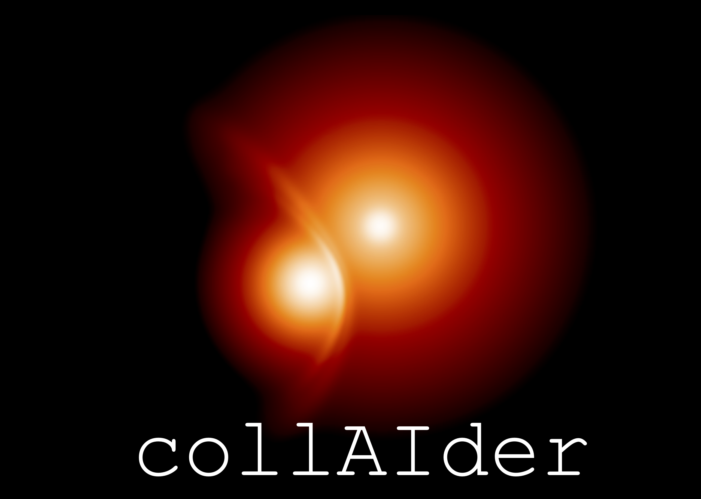

<p align="center">
  
</p>

A machine learning-based tool for predicting the outcomes of stellar encounters using neural networks trained on Smoothed Particle Hydrodynamics (SPH) simulation data. collAIder classifies encounters into physical regimes (collision, tidal capture, and flyby) and predicts post-encounter stellar masses.
[](https://doi.org/10.5281/zenodo.19601411 )
[](https://arxiv.org/abs/2602.10191)
[](LICENSE)

---

## Citation

If you use collAIder in your research, please cite the associated paper:

**Paper:**
> González Prieto, E., et al. (2026). *Machine Learning Methods for Stellar Collisions. I. Predicting Outcomes of SPH Simulations*. *arXiv*, arXiv:2602.10191. https://arxiv.org/abs/2602.10191

In BibTeX:
```bibtex
@article{GonzalezPrieto2026,
  author  = {González Prieto, E. and others},
  title   = {Machine Learning Methods for Stellar Collisions. I. Predicting Outcomes of SPH Simulations},
  journal = {arXiv},
  year    = {2026},
  eprint  = {2602.10191},
  archivePrefix = {arXiv}
}
```
---

## Description

collAIder predicts the outcome of stellar encounters using a two-component machine learning pipeline:

1. **Classifier** — determines the physical regime of the encounter (collision, tidal capture, or flyby).
2. **Regressor** — predicts quantitative post-encounter properties (remnant masses, unbound mass) for collisions.

The models were trained on SPH simulation data available in [](https://doi.org/10.5281/zenodo.19615605) which uses MESA stellar models available in [](https://doi.org/10.5281/zenodo.19392209). To determine the regime of the encounter, collAIder estimates stellar radii as a function of mass and age using stellar evolution tracks from [POSYDON v2](https://posydon.org/). Tidal dissipation during close encounters follows the polytrope approximations of Portegies Zwart & McMillan (1993) and Mardling & Aarseth (2001).

The collAIder Website can be found at: https://elenagonzalez870.github.io/collAIder/

## Repository Structure

```
collAIder/
├── README.md              # This file
├── CITATION.cff           # Machine-readable citation metadata
├── LICENSE                # Software license
├── src                    # Source Files
    ├── encounter_physics.py   # Physics-based regime classifier (shared by both models)
    ├── model_MoE.py           # Mixture of Experts Architecture
    ├── model_NN.py            # Neural Network Architecture
├── models/                # Trained Models
├── docs/                  # Documentation assets (logo, figures)
├── data/                  # Data used to train models
    ├── data_v1.csv        # Output from SPH collisions
    ├── data_splits_v1.npz # Data standard scaled and split into train/val/test datasets
    └── POSYDON*.          # Posydon v2 stellar models
├── scripts/               # Analysis and plotting scripts
├── tests/                 # Characterization test suite (run with pytest)
└── examples/
    ├── Tutorial.ipynb         # End-to-end workflow tutorial
    ├── NN_tutorial.ipynb      # Neural network standalone tutorial
    └── MoE_tutorial.ipynb     # Mixture of Experts standalone tutorial
```

---

## Installation

### Requirements

collAIder requires Python 3.8 or later and the following packages:

```
torch
numpy
h5py
```

Install dependencies with:

```bash
pip install torch numpy h5py
```

### Get the code

```bash
git clone https://github.com/elenagonzalez870/collAIder.git
```

For a system-wide installation accessible to all users, clone directly to the default location:

```bash
sudo git clone https://github.com/elenagonzalez870/collAIder.git /usr/local/share/collAIder
```

If you install to a custom location, set the `COLLAIDER_PATH` environment variable (see [Setting COLLAIDER_PATH](#setting-collaider_path) below).


The POSYDON v2 stellar evolution grids must also be available. See the [POSYDON documentation](https://posydon.org/) for installation instructions. They can also be downloaded from the Zenodo page [](https://doi.org/10.5281/zenodo.19601411 )

Once downloaded, place the `.h5` file at the following path within the repository:
```
data/POSYDON_data_v2_grids_0.01Zsun.tar.gz/POSYDON_data/single_HMS/1e-02_Zsun.h5
```
---

## Setting COLLAIDER_PATH

The Quick Start script locates collAIder via the `COLLAIDER_PATH` environment variable. If you install to the default location (`/usr/local/share/collAIder`), no further action is needed.

If you install elsewhere, set `COLLAIDER_PATH` to your installation directory:

```bash
export COLLAIDER_PATH=/path/to/your/collAIder
```

To make this permanent, add the line to your shell startup file:

- **bash:** add to `~/.bashrc`
- **zsh:** add to `~/.zshrc`

Then reload your shell:

```bash
source ~/.bashrc   # or ~/.zshrc
```

## Quick Start

```python
import sys, os

# Set COLLAIDER_PATH to your collAIder installation directory
COLLAIDER_PATH = os.environ.get('COLLAIDER_PATH', '/usr/local/share/collAIder')
sys.path.insert(0, os.path.join(COLLAIDER_PATH, 'src'))
os.chdir(os.path.join(COLLAIDER_PATH, 'src'))

# from model_MoE import process_encounters  # alternative model
from model_NN import process_encounters

# Define encounter parameters
results = process_encounters(
    ages           = [2.0],   # Age [Gyr]
    masses1        = [1.0],   # Primary mass [M_sun]
    masses2        = [0.8],   # Secondary mass [M_sun]
    pericenters    = [0.5],   # Pericenter distance [R_sun]
    velocities_inf = [10.0],  # Relative velocity at infinity [km/s]
)

print(results)
```

For a full demonstration, see [examples/Tutorial.ipynb](examples/Tutorial.ipynb).

## Running the Tests

The repository ships with a characterization test suite that pins the behavior of both model backends. From the repository root:

```bash
pip install pytest
pytest
```

---

## Encounter Regimes

collAIder classifies each stellar encounter into one of three physical regimes:

| Flag | Regime | Physical Condition |
|------|--------|--------------------|
| `-1` | **Collision** | Pericenter distance < R₁ + R₂ |
| `-2` | **Tidal Capture** | Stars become gravitationally bound via tidal energy dissipation |
| `-3` | **Flyby** | Stars pass without significant interaction |

---

## Output Format

Each result is a Python dictionary with the following keys:

- **`regime_flag`** — Integer code for the encounter type (`-1`, `-2`, or `-3`; see above).
- **`predicted_class`** — Classification label: 0 = both stars destroyed; 1 = merger; 2 = two stars remain; 3 = one stripped star remains.
- **`predicted_values`** — List of `[star_mass1, star_mass2, unbound_mass]` in M☉.
- **`class_probs`** — List of the four classification probabilities (softmax over the classes above; sums to 1). Tidal captures and flybys return a one-hot vector, since their outcome is set by the physics-based classifier rather than the neural network.

---

## Assumptions and Caveats

Users should be aware of the following limitations before applying collAIder to their science case.

### Stellar Evolution
- **Main sequence only.** Stars must be on the main sequence (MS). Post-TAMS stars (central H fraction < 10⁻⁵) will raise a `ValueError`.
- **Metallicity.** Stellar tracks are computed at Z = 0.01 Z☉. Results for other metallicities may be unreliable.
- Stellar radii are interpolated from POSYDON v2 grids as a function of stellar mass and age.

### Mass Range
- Validated for stellar masses in the range ~0.1–100 M☉. Extrapolation outside this range is not recommended.

### Tidal Dissipation
Polytrope approximations from Portegies Zwart & McMillan (1993) and Mardling & Aarseth (2001) are used, with polytrope index:
- n = 1.5 for M < 0.8 M☉ (convective envelopes)
- n = 3.0 for M > 0.8 M☉ (radiative envelopes)
- Linear interpolation for 0.4 M☉ < M < 0.8 M☉ (mixed envelope structure)

### Simplified Physics
- Tidal capture is assumed to result in a perfect merger with no mass loss.
- Flyby encounters are assumed to produce no mass transfer.
- Stellar rotation and stellar winds are not modeled.

---

## Error Handling

The following errors will be raised for invalid inputs:

| Error | Cause |
|-------|-------|
| `ValueError` | Post-TAMS star detected (central H fraction < 10⁻⁵) |
| `ValueError` | Input arrays have mismatched lengths |
| `FileNotFoundError` | Pre-trained `.pt` weight files not found |

---

## Tutorials

Interactive Jupyter notebook tutorials are provided in the `examples/` directory:

- [**Tutorial.ipynb**](examples/Tutorial.ipynb) — Complete end-to-end workflow using collAIder.
- [**NN_tutorial.ipynb**](examples/NN_tutorial.ipynb) — How to use the neural network regressor independently.
- [**MoE_tutorial.ipynb**](examples/MoE_tutorial.ipynb) — How to use the Mixture of Experts classifier independently.

---

## References

- Portegies Zwart, S. F., & McMillan, S. L. W. (1993). *The evolution of close triple stars.* ApJ, 410, 759. doi:[10.1086/172795](https://doi.org/10.1086/172795)
- Mardling, R. A., & Aarseth, S. J. (2001). *Tidal interactions in star cluster simulations.* MNRAS, 321, 398. doi:[10.1046/j.1365-8711.2001.03974.x](https://doi.org/10.1046/j.1365-8711.2001.03974.x)
- Fragos, T., et al. (2023). *POSYDON: A General-Purpose Population Synthesis Code Based on Detailed Binary-Evolution Simulations.* ApJS, 264, 45. doi:[10.3847/1538-4365/ac90c1](https://doi.org/10.3847/1538-4365/ac90c1)
- Paxton, B., et al. (2011). *Modules for Experiments in Stellar Astrophysics (MESA).* ApJS, 192, 3. doi:[10.1088/0067-0049/192/1/3](https://doi.org/10.1088/0067-0049/192/1/3)

---

## License

This software is distributed under the [MIT License](LICENSE).

---

## Contact

Elena González Prieto — elena.prieto [at] northwestern.edu

For bug reports or feature requests, please open an [issue](https://github.com/elenagonzalez870/collAIder/issues).

---

## Acknowledgments

This work makes use of:

- [POSYDON v2](https://posydon.org/) stellar evolution grids (Fragos et al. 2023)
- [PyTorch](https://pytorch.org/) for neural network implementation
- SPH simulation data for model training and validation
- MESA models